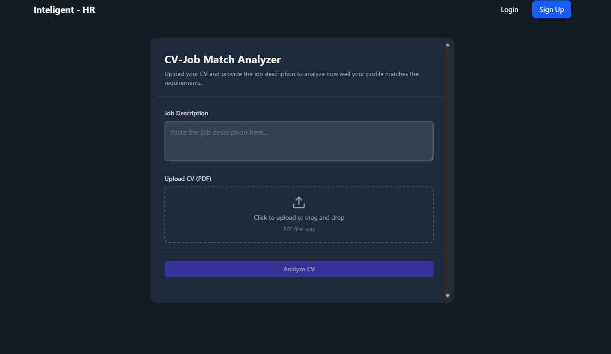

# 🚀 AI CV Checker

> Revolutionizing Resumes. Empowering Recruiters.

I'm excited to introduce **AI CV Checker** – a smart, responsive, and fully-functional web application designed to **transform job applications and recruitment processes** using the power of AI.

🔗 **Live Website**: [https://your-aicvchecker-domain.com](https://www.aicvchecker.software/)

---

## ✨ Why We Built This

As passionate problem-solvers, we noticed two huge pain points in the job market:

1. 🎯 Job seekers struggle to optimize resumes for each application.
2. 🕒 Recruiters waste hours manually screening CVs.

**AI CV Checker** bridges that gap with automation and intelligence.

---

## 💼 What It Does

### For Job Seekers:
- ✅ Instant CV scoring against any job description
- 🔍 Identifies missing skills and suggests improvements
- 🤖 Predicts likely interview questions tailored to your resume

### For Recruiters & Companies:
- ⚡ Auto-scores and ranks hundreds of resumes instantly
- 🔝 Filters top candidates in minutes, not hours
- 📬 One-click email outreach to selected applicants
- 🧠 Generates personalized interview questions per candidate

---

## 🌐 Tech Stack

- **Frontend**: HTML, CSS, JavaScript (Responsive UI)
- **Backend**: Python (AI & Logic)

Responsive across **desktop, tablet, and mobile**. Clean UX for both applicants and recruiters.

---

## 📸 Demo Screenshots

| Desktop Demo | Mobile Demo |
|--------------|-------------|
|  |  |

🎥 **Video Demo**: [Watch on Google Drive](https://drive.google.com/file/d/1kNqZJOCZfThBXK-FyzlNtbjpNcSACU6J/view?usp=drive_link)

---

## 🧰 Prerequisites

Before running locally, ensure:

- ✅ [Git](https://git-scm.com/downloads) is installed
- ✅ Python 3.8+ environment setup

---

## 💡 Business Opportunity

This AI tool is ready for integration into:

- 🔌 Company Career Portals  
- 👥 Recruitment Agency Platforms  
- 🏢 HR Tech SaaS Products  

Use it to:

- ⏱ Save countless hours of manual screening  
- 🧠 Improve hiring with data-driven decisions  
- 🚀 Boost applicant success with smarter CVs  

---

## 📬 Get In Touch

💼 Interested in licensing, integration, or collaboration?

➡️ Message me directly  
➡️ Comment **"CV AI"**  
➡️ Or connect here:

- 📧 Email: [himel35-1078@diu.edu.bd](mailto:himel35-1078@diu.edu.bd)  
- 💼 LinkedIn: [Tasrif Nur Himel](https://www.linkedin.com/in/tasrifnurhimel/)

---

## 🛡️ License & Credits

© 2025 [Tasrif Nur Himel](https://www.linkedin.com/in/tasrifnurhimel/). All rights reserved.

Licensed under the [MIT License](./LICENSE).

---

